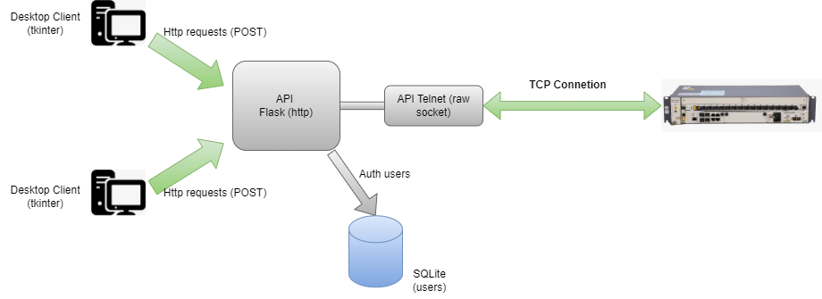

# Gpon API (Flask)
### Мой старый проект (2020-2021 года)

Этот API создан для следующей новой версии моей реализации Gpon-интерфейса<br>
Первая версия интерфейса: [Gpon_interface_v1](https://github.com/sita8281/Gpon_interface_v1) (не использует клиент-серверный подход)

Новый интерфейс (для него и создан данный API): [Gpon_interface_v2](Gpon_interface_v2
)

### Схема взаимодействия (клиент-сервер)


### Установка
Клонируем
``` 
git clone https://github.com/sita8281/Gpon_api_flask_v2.git
```

Ставим окружение
```
cd Gpon_api_flask_v2
python -m venv venv
```

Активируем env (linux)
```
source venv\bin\activate
```

Активируем env (windows)
```
venv\scripts\activate.bat
```

Устанавливаем библиотеки
```
pip install -r requirements.txt
```

Запуск
```
python run.py
```

Адрес и порт сервера можно изменить в файле: run.py
```python
if "__main__" == __name__:
    app.run(host="0.0.0.0", port=5000)
```


